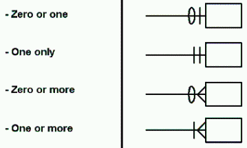

# Explanations

## Wireframes

The HCI's wireframes (used in development) can be found
[here](./img/wireframes.svg). These wireframes show how we want the user
interface to look.

## Data Model

The HCI data model can be found [here](./img/data-model.svg). It uses
information engineering notation as shown below:

The data model shows the relationships between the classes in the HCI.
